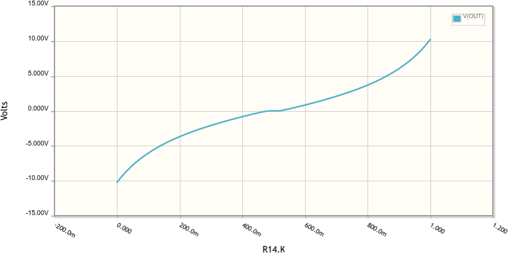
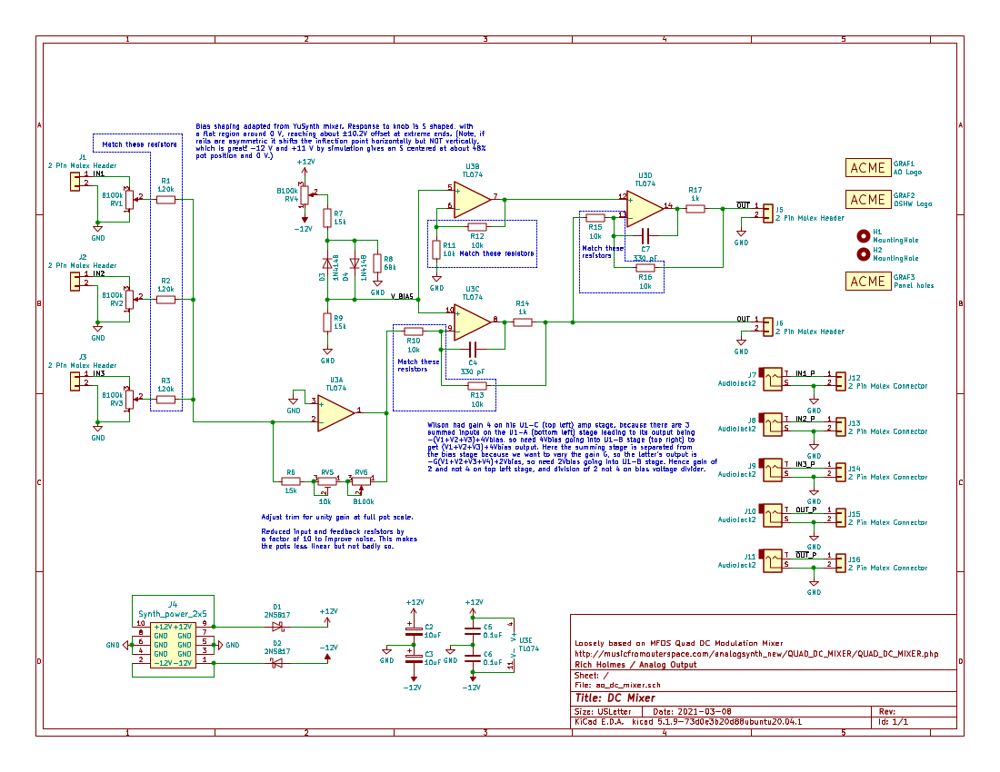
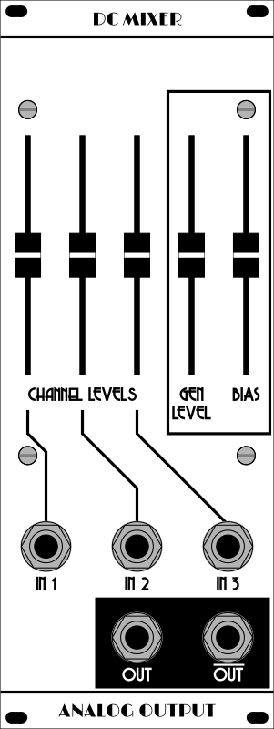

## AO DC Mixer

This is a DC coupled 3-input mixer, designed mainly for mixing control voltage signals. It is based loosely on the MFOS Quad DC mixer (but only one unit per module). A lot has been changed:

* For a general gain control, split MFOS's first op amp stage into an inverting variable gain mixing stage and an inverting unity gain with bias stage. This means MFOS's normal output became the inverted output and vice versa.
* In Wilson's design, bias was applied to stage with 3 summed inputs so output was -(V1+V2+V3)+4Vbias, so he needed 4Vbias going into the last stage to get output of (V1+V2+V3)+4Vbias. Hence the gain of 4 on the bias amplification stage. Here the sum is separated from the bias, so bias stage output is -(V1+V2+V3)+2Vbias. Therefore changed gain from 4 to 2. Also, to get same offset range, changed the offset voltage divider to divide by 2, not 4.
* Added antiparallel diodes and a pulldown resistor in the offset voltage divider, a la YuSynth mixer. This and the small value resistors makes the response to the offset knob knob S shaped, with a flat region around 0 V, reaching about ±10.2 V offset at extreme ends. 
 
Note, if rails are asymmetric it shifts the inflection point horizontally but *not* vertically, which is great! -12 V and +11 V by simulation gives an S centered at about 48% pot position and 0 V.
* Reduced impedances in most stages.

## Documentation

* [Build notes and calibration](Docs/build_notes.md) 
* [Schematic](Docs/ao_dc_mixer.pdf)
* [BOM](Docs/ao_dc_mixer_bom.pdf)

 
 
